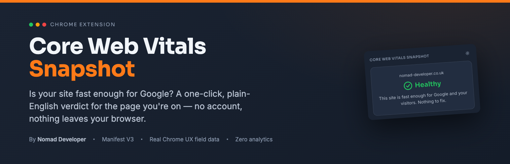
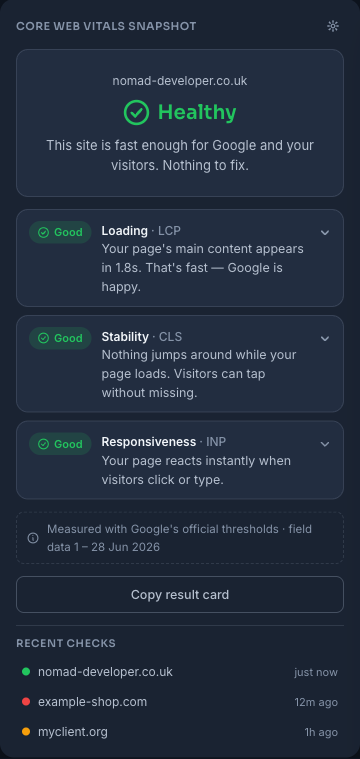
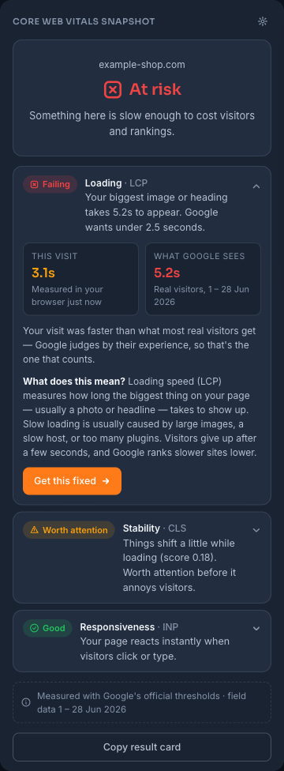
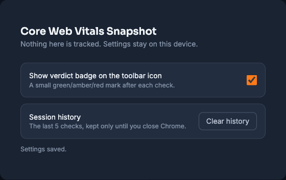
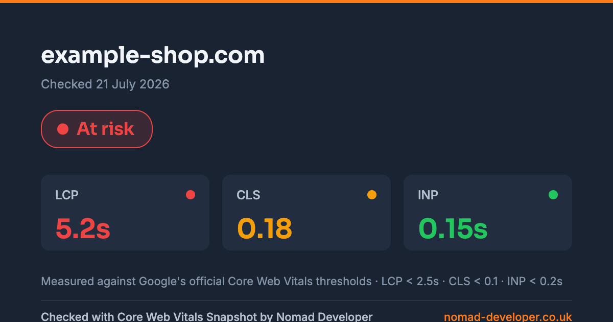

<p align="center">
  
</p>

<h1 align="center">Core Web Vitals Snapshot</h1>

<p align="center">
  <strong>Is your site fast enough for Google? Find out in one click.</strong>
</p>

<p align="center">
  A Chrome extension that gives you a plain-English Core Web Vitals verdict for the page you're on —<br />
  it reads the same real-visitor data Google ranks with, translates it out of jargon, and tells you<br />
  whether anything is worth fixing. No account, no analytics, nothing leaves your browser.
</p>

<p align="center">
  
  
  
  
  
</p>

<p align="center">
  <a href="#-quick-start">Quick start</a> ·
  <a href="#what-it-does">Features</a> ·
  <a href="#screenshots">Screenshots</a> ·
  <a href="#how-it-works">How it works</a> ·
  <a href="#privacy">Privacy</a> ·
  <a href="#development">Development</a>
</p>

<p align="center">
  Author: <a href="https://www.nomad-developer.co.uk/">Costin Botez</a> (<a href="https://www.instagram.com/costinbotez/">@costinbotez</a>) ·
  <a href="https://www.nomad-developer.co.uk/">Portfolio</a> ·
  <a href="https://www.instagram.com/costinbotez/">Instagram</a> ·
  <a href="https://github.com/costibotez">GitHub</a>
</p>

---

## Why this exists

"PageSpeed says my score is 63 — is that bad?" is the wrong question, and it's the only one most tools answer. Site owners get a coloured number and a wall of acronyms, but no idea whether they've actually got a problem or what it's costing them.

Core Web Vitals Snapshot answers the real question — *is this good enough for Google and my visitors, yes or no?* — in a sentence a non-technical owner can act on:

- You click the toolbar icon on any page. In under two seconds you get **one verdict** — Healthy, Needs attention, or At risk — and a plain sentence for each of the three metrics Google ranks with.
- Every acronym rides with a human word (**Loading · LCP**, **Stability · CLS**, **Responsiveness · INP**), and only failing metrics ever get a "get this fixed" button. Healthy pages get nothing to sell — the tool is an instrument, not an advert.

## What it does

### 🚦 A one-click, plain-English verdict
- Click the icon and read a single **Healthy / Needs attention / At risk** verdict for the current page, colour, icon **and** words — never colour alone
- One honest sentence per metric: *"Your biggest image or heading takes 5.2s to appear. Google wants under 2.5 seconds."*
- Expand any row for the full explanation — what the metric is, why it matters, and what usually causes it — written for the person paying the invoice, not the person writing the code

### 📊 Real Google field data, not just a lab guess
- Pulls **p75 LCP, CLS and INP** from the [Chrome UX Report](https://developer.chrome.com/docs/crux) — the real experience of your visitors over the last 28 days, which is what Google's rankings actually use
- Measures **this visit live** in your own browser too (official `web-vitals` attribution build), so you see both the lab reading and the field reading side by side
- When the two disagree, the row explains it in one sentence — **the field data always wins the verdict**, because that's what Google judges you on
- No field data yet? Common for smaller sites — the popup says so calmly and falls back to this visit, no alarm

### 🖼️ A shareable result card
- One button renders a branded **1200×630 PNG** on a canvas and copies it to your clipboard — paste it into an email, a report, or a client chat
- Rendered entirely in the popup; the image is **never uploaded anywhere**

### 🧰 Fits into your day
- **Recent checks** — the last 5 sites you looked at, one tap to reopen (kept only until you close Chrome)
- **Toolbar badge** — an optional green / amber / red mark on the icon after each check
- **Zero-jargon options page** — one toggle, one clear-history button, and a promise that nothing is tracked

### 🔒 Private by design
- **The only network request the extension ever makes is the CrUX lookup**, straight from your browser to Google. There is no server of ours, no analytics, no telemetry — nowhere for your browsing to go
- **No content script is declared**, so there's no "read your data on all websites" install warning — measurement only ever runs on the tab whose icon you clicked (`activeTab`)
- Host access is locked to a single domain: `chromeuxreport.googleapis.com`

## ⚡ Quick start

Not on the Chrome Web Store yet — load it unpacked in under five minutes:

1. **Clone and install**
   ```bash
   git clone https://github.com/costibotez/core-web-vitals-snapshot.git
   cd core-web-vitals-snapshot
   npm install
   ```
2. **Add a CrUX API key.** Copy `.env.example` to `.env` and paste a free key with the [Chrome UX Report API](https://console.cloud.google.com/apis/library/chromeuxreport.googleapis.com) enabled (referrer-locked is fine — it's baked in at build time):
   ```bash
   cp .env.example .env
   # then edit .env → VITE_CRUX_API_KEY=your_key
   ```
   *No key? The extension still runs — it just behaves like a site with no field data and shows the live reading only.*
3. **Build** → `npm run build` (typecheck + both Vite passes → `dist/`)
4. **Load it.** Open `chrome://extensions`, turn on **Developer mode**, click **Load unpacked**, and select the `dist/` folder.
5. **Use it.** Open any normal website and click the Core Web Vitals Snapshot icon.

## Screenshots

| Healthy verdict | Something at risk |
|---|---|
|  |  |

| Options — nothing tracked | Shareable result card |
|---|---|
|  |  |

## How it works

The verdict is deliberately boring and rule-based — no scoring model, no magic. Google's own thresholds are the single source of truth:

| Metric | Good | Needs improvement | Poor |
|---|---|---|---|
| **Loading** · LCP | ≤ 2.5 s | ≤ 4.0 s | > 4.0 s |
| **Stability** · CLS | ≤ 0.1 | ≤ 0.25 | > 0.25 |
| **Responsiveness** · INP | ≤ 200 ms | ≤ 500 ms | > 500 ms |

The overall verdict rolls those up: **any poor metric → At risk**; **any needs-improvement (and none poor) → Needs attention**; **otherwise Healthy**. Where a live reading and CrUX disagree, CrUX wins — it's the field data Google ranks with.

Under the hood, on the tab you clicked:

1. **`activeTab` + `scripting`** let the service worker inject `content/measure.js` — the official `web-vitals` library (attribution build, `reportAllChanges`). Buffered `PerformanceObserver`s mean injecting at popup-open time still recovers the page visit's full LCP / CLS / INP history.
2. The service worker **POSTs the origin to CrUX** for desktop p75 field data, caching each origin for 24 hours in `chrome.storage.session`.
3. The popup merges the two, picks the verdict, and renders it with zero layout shift — every state reserves its own space, so nothing jumps.

## Privacy

Privacy isn't a feature bolted on — it's the whole permission model:

| Permission | Why it's needed |
|---|---|
| `activeTab` | Measure **only** the tab whose icon you clicked. No declared content script → no "read data on all sites" warning. |
| `scripting` | Inject the measurement script into that one tab after the `activeTab` grant. |
| `storage` | `chrome.storage.session`: recent checks (last 5) + the 24 h CrUX cache. `chrome.storage.local`: the badge on/off preference. |
| `host_permissions` | Exactly one host: `https://chromeuxreport.googleapis.com/*`. |

**No analytics anywhere in the extension.** The only request that ever leaves your browser is the CrUX lookup for the origin you're checking.

## Development

- **Manifest V3**, TypeScript, Vite + `@crxjs/vite-plugin` for the popup / options / service worker.
- A second Vite pass (`vite.content.config.ts`) builds the measurement script as a classic IIFE, because it's injected with `chrome.scripting.executeScript` (no ES-module support there).
- No UI framework in the popup — vanilla TypeScript and CSS custom properties. Fonts (Sora + Inter) are bundled as woff2; the extension never fetches remote fonts.

```
manifest.config.ts       Manifest V3 definition (@crxjs)
vite.config.ts           Popup / options / worker build
vite.content.config.ts   IIFE build → dist/content/measure.js
src/
  popup/                 Verdict UI, result-card canvas, dev mock
  options/               Badge toggle + clear-history page
  background/            Service worker: CrUX fetch + 24h cache, history, badge
  content/               web-vitals measurement, injected on demand
  shared/                Thresholds, verdict logic, plain-English copy, types
  assets/fonts/          Bundled Sora + Inter woff2
public/icons/            Toolbar icons (16/32/48/128)
scripts/                 Icon generation
```

| Command | What it does |
|---|---|
| `npm run build` | Typecheck, then both Vite passes → `dist/` |
| `npm run dev` | Preview the popup in a browser (auto-mocks the extension APIs) |
| `npm run icons` | Regenerate the toolbar icons |

All user-facing copy lives in `src/shared/verdict.ts` and `src/shared/explainers.ts` — edit sentences there, never in the markup.

## Roadmap

- Publish to the Chrome Web Store
- Mobile (form factor) field data alongside desktop
- Optional history that survives a browser restart
- A companion page on [nomad-developer.co.uk](https://www.nomad-developer.co.uk/) explaining each metric and how to fix it

## License

© 2026 Costin Botez / Nomad Developer. All rights reserved.

---

<p align="center">
  
</p>

<p align="center">
  Built and maintained by <a href="https://www.nomad-developer.co.uk/">Costin Botez</a> — <a href="https://www.nomad-developer.co.uk/">Nomad Developer</a> · <a href="https://www.instagram.com/costinbotez/">@costinbotez</a><br />
  WordPress development, care plans and performance work for agencies and small businesses.
</p>
